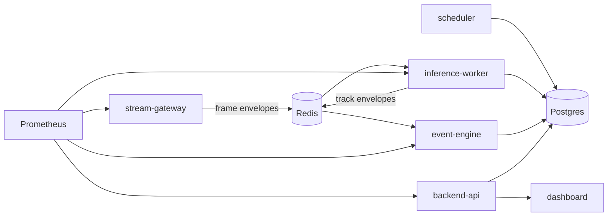

# Architecture

The MVP is intentionally split into five services so ingest, inference, eventing, and presentation remain independently replaceable.

## Current Runtime Model

- cameras are seeded from `config/cameras.seed.json`
- stream gateway emits synthetic frame metadata at per-camera target FPS
- inference worker uses a deterministic tracker stub to create stable track IDs
- event engine evaluates zone entry, line crossing, and loitering rules
- backend API serves persisted state for demo and monitoring

## Upgrade Paths

- replace synthetic frame emission with RTSP ingest and image bytes
- move from mocked tracking to YOLO + ByteTrack
- introduce image snapshot generation and object crops
- split metrics storage from Postgres if high-cardinality signals grow

